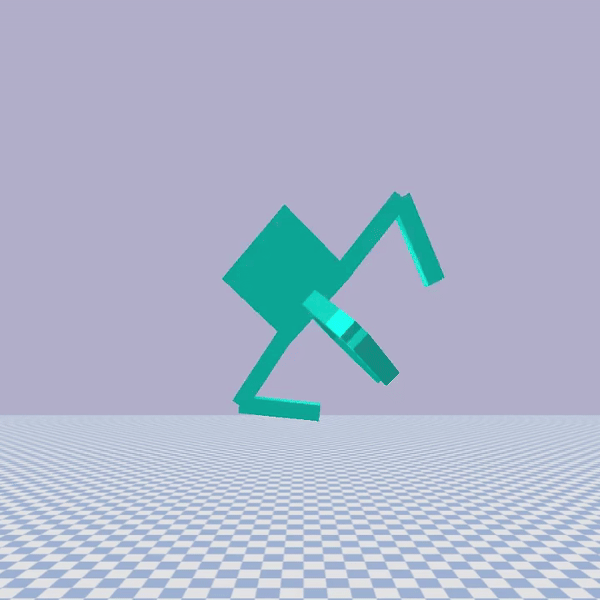

# Evolutionary Robotics
Personal repository for the Evolutionary Robotics (CS 3060) course at the University of Vermont.

Learning how to build and evolve simulated robots to perform a variety of tasks.

Each branch is associated with an assignment.

Assignments can be found [here](https://www.reddit.com/r/ludobots/wiki/installation/).

Deliverables can be found [here](https://www.youtube.com/playlist?list=PLjP8SIESqGxkFOJcTzQwaoRhby7JkXoZs).

## Final Project: Station Keeping
Evolving station keeping in a hydrodynamic environment. Video can be found [here](https://www.youtube.com/watch?v=o2zA9elkmh4)

